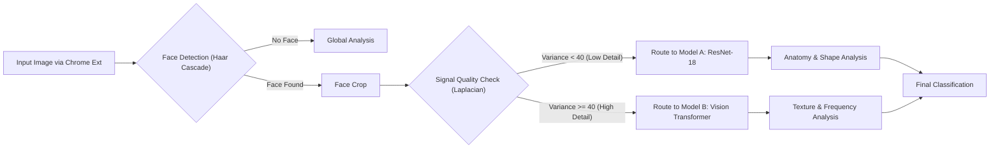

# Adaptive AI-Generated Images Detector (Hybrid ResNet + ViT)

> **A robust, browser-based forensic tool that detects AI-generated images by dynamically routing inputs between a Convolutional Neural Network (ResNet-18) and a Vision Transformer (ViT) based on signal quality analysis.**


---

## Project Overview

As generative AI evolves from **GANs** (Generative Adversarial Networks) to **Diffusion Models** (Midjourney, Stable Diffusion), detection methods must adapt. Single-model detectors often suffer from a **"Domain Gap"**:
* **Legacy Models (CNNs)** fail on hyper-realistic textures because they prioritize shape/anatomy.
* **Modern Models (Transformers)** fail on blurry/low-res images because they hallucinate artifacts in noise.

This project introduces an **Adaptive Inference Router** that analyzes the input signal quality (Laplacian Variance) to select the optimal neural network for the task, achieving robust detection across both image domains.

---

## System Architecture

The core innovation is the "Smart Router" middleware which sits between the API and the Inference Engines.



---

##  Model Details & Training Pipeline

The system uses a hybrid approach, routing images to the model best suited for the specific image quality.

### 1. Model A: Custom ResNet-18
* **Purpose:** Detects geometric anomalies (warped irises, asymmetrical ears) common in GANs and low-resolution Deepfakes.
* **Architecture:** ResNet-18 (Pre-trained on ImageNet).
* **Dataset:** [CIFAKE (140,000 Images).](https://www.kaggle.com/datasets/xhlulu/140k-real-and-fake-faces)
* **Split:** 70,000 Real / 70,000 Fake.
* **Training Configuration:**
    * *Optimizer:* Adam (`lr=0.001`).
    * *Loss Function:* CrossEntropyLoss.
    * *Augmentation:* Random Horizontal Flip (`p=0.5`), Random Rotation (`±10°`).
* **Performance Metrics:**
    * **Accuracy:** 94.2% (Test Set).
    * **Recall:** 93.0% (Strong against GAN artifacts).

### 2. Model B: Vision Transformer
* **Purpose:** Detects high-frequency noise artifacts and "perfect texture" inconsistencies common in Diffusion models.
* **Architecture:** ViT-Base-Patch16-224.
* **Source:** Hugging Face (`dima806/deepfake_vs_real_image_detection`).
* **Mechanism:** Uses Self-Attention to analyze the relationship between 16x16 pixel patches, identifying unnatural noise distributions that CNNs miss.

### 3. The Signal Router (Laplacian Variance)
* **Algorithm:** `cv2.Laplacian(image, cv2.CV_64F).var()`
* **Logic:** Calculates the variance of edges in the image to determine signal quality.
* **Thresholds:**
    * **< 40 (Low-Frequency/Blurry):** Routed to **ResNet** (Avoids ViT hallucinations).
    * **> 40 (High-Frequency/Sharp):** Routed to **ViT** (Leverages texture analysis).
* **Note:** Threshold specifically tuned to handle "Bokeh" (background blur) and curly hair textures.

---

## Project Structure

```bash
DeepFake-Detector/
├── api/
│   ├── main.py                # FastAPI Backend & Routing Logic
│   └── resnet18_deepfake.pth  # Custom Trained Weights
│   
├── extension/
│   ├── manifest.json          # Chrome V3 Manifest
│   ├── background.js          # Context Menu & API Communication
│   └── icon.png               # App Icon
└── README.md                  # Documentation
```

## Tutorial: How to Run This Locally
Follow these steps to set up the project on your own PC.

**Prerequisites**
* **Python** 3.10+ (Make sure to check "Add to PATH" during installation)

* **Git** (To clone the repo)

**Step 1: Clone and Install**
Open your terminal (Command Prompt or PowerShell) and run:
```bash
# 1. Clone the repository
git clone [https://github.com/yourusername/deepfake-detector.git](https://github.com/yourusername/deepfake-detector.git)
cd deepfake-detector

# 2. Create a virtual environment (Recommended)
python -m venv venv

# 3. Activate the environment
# Windows:
.\venv\Scripts\activate
# Mac/Linux:
# source venv/bin/activate

# 4. Install dependencies
pip install -r api/requirements.txt
```

**Step 2: Start the Backend Server**
This will start the AI engine on your local machine.

```bash
cd api
uvicorn main:app --reload
```
Note: The first time you run this, it will automatically download the Vision Transformer model (~300MB). Wait until you see: `Application startup complete`.

**Step 3: Test it(Choose your method)**

**Option A: The Chrome Extension (Full Experience)**
1. Open Chrome and type `chrome://extensions/` in the URL bar.
2. Toggle Developer mode (top right switch).
3. Click the Load unpacked button.
4. Select the `extension` folder inside this project.
5. Go to any website (e.g., Google Images), Right-Click an image, and select 🔍 Scan for DeepFake.

**Option B: The "Quick Script" (For Developers)**
If you don't want to install the extension, you can test the API directly with a Python script.

1. Save an image (e.g., `test_image.jpg`) in your project folder.
2. Create a file named `test_request.py` and paste this code:

```python
import requests

url = "[http://127.0.0.1:8000/predict](http://127.0.0.1:8000/predict)"
image_path = "test_image.jpg"  # Change this to your image name

with open(image_path, "rb") as file:
    files = {"file": file}
    response = requests.post(url, files=files)

print(response.json())
```

3. Run it:
```bash
python test_request.py
```
4. You will see the JSON output with the Confidence Score and Router Decision.